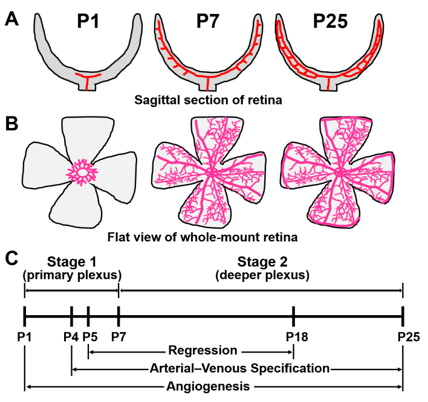
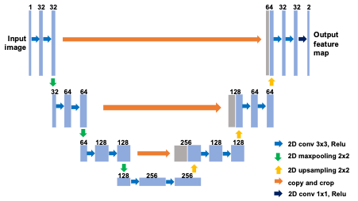
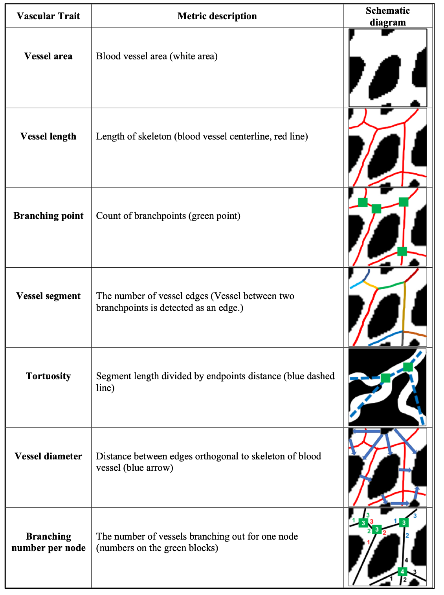

```{r setup, include=FALSE}
knitr::opts_chunk$set(cache=TRUE, autodep=TRUE, cache.comments=TRUE)
```

## Introduction
Small blood vessels play critical roles in vascular development and diseases (such as myocardial infarction, stroke, and dementia). Genetic and environmental perturbations are responsible for the functional change of these vessels; however, the underlying complex mechanisms have not been well studied. It has been appreciated that vascular morphological features reflect the vessel biological functions, and analysis of these features is critical for understanding physiological and pathological processes of vascular development and vascular diseases. The mouse retina is a well-recognized and commonly used animal model for small blood vessel related studies. Therefore, there is a need for powerful tools to analyze the morphological changes of retinal vasculature during development and diseases.

The mouse retina is a well-recognized and commonly used animal model for angiogenesis and microvascular remodeling. The development of the mouse retinal vasculature starts after birth (P0) through postnatal day 25 (P25), which includes two stages: primary plexus formation and deeper plexus formation, see Figure 1. 

From P0 to P7, the first vessel arises from the optic nerve head and spreads radially over the entire retina by following a preceding formed network of astrocytes. After P7, the vessel begins to penetrate into the retina to form the deep plexus12. During P0 to P7, two pivotal processes--angiogenesis and micro-vascular remodeling--occur, which alters the vessel architecture. Angiogenesis is the process where new blood vessels grow from existing ones by sprouting. Vascular remodeling is usually expressed as structural alterations such as vessel regression (pruning), vessel diameter and area change, and artery-vein specification without the formation of new vessels. These processes are also essential for organ development, progression of vascular diseases (i.e., myocardial infarction, stroke, and dementia) and tumor growth.

{width=50%}

Extraction and analysis of retinal vascular morphology is still a developing field. In this project, you will be given training, validation, and test data to develop your own `pipeline` to analyze the vascular morphology.  There are many existing software tools to do similar task. Examples include: including Angioquant[@niemisto2005robust], Angiotool[@zudaire2011computational], RAVE[@seaman2011rapid], and Autotube[@montoya2019autotube]. If you take a close look of these method, you will find that, they all based on some thresholding method to segment the vessel out. However, with recent development in computer vision and machine learning, there are more accurate and "simple" (to some aspect) methods to better segment the vessel out, e.g., the CNN or deep learning method. You can read https://neptune.ai/blog/image-segmentation-in-2020 to get a sense of different network architectures for imaging segmentation tasks. 

The imaging segmentation task in our case can be simply considered as a logistic regression problem - using the pixel's and its neighborhood's information as predictors to predict the probability of this pixel being a vessel or the background. A particular network structure, called U-net, is particular suitable for this segmentation task. More details can be found in this survey paper [@ronneberger2015u]. 

In this project, you will be given a few mouse retina images collected in the following ways:  C57 mice at age P1 to P7 were euthanized, and their eyes were enucleated and fixed in 4% paraformaldehyde (PFA) for 100 minutes on ice. The retinas were isolated under a dissecting microscope and stored in methanol at -20°C or immediately used for whole mount immunofluorescent (IF) staining. Retinas for IF staining were incubated with the blocking buffer (1% BSA and 0.3% triton-100 dissolved in PBS) for 1 hour, followed by incubation in the blocking buffer with biotinylated isolectin B4 (IB4) (1:200; Vector Labs, B-1205) at 4 °C overnight. Retinas were washed and incubated in Alexa Fluor streptavidin conjugated (1:200; Invitrogen, S32351) and blocking buffer at room temperature for 2 hours. After brief wash with PBS, the retinas were flat mounted and visualized by laser scanning confocal microscopy (Olympus confocal system, FluoView) with Z-Stack scan on 10X for whole retina image. Go to fold `Data` to find the final images. 


Final project questions (suggested)
===
For the final project, your tasks can be simply summarized as: 

 - Develop an algorithm to segment the blood vessel out;
 
 - Develop functions to extract vessel network from the segmented blood vessel;
 
 - Extract features from the network + segmented image;
 
 - Conduct statistcal analysis (EDA + visualization) to these features you extracted for vessels obtained from P2 to P7. Read literature about angiogenesis (espcially for small mouse) and see if you can come up with nice stories and interpretations.  

Blood Vessel Segmentation
===
You are encouraged to use the latest CNN method (e.g., U-net) to perform the segmentation. This might require you study on your own how to construct a U-net with pytorch.  In this simple application, GPU might not be needed to train your model training. A suggested U-net architecture is shown in Figure 2.  Check Ronneberger et al. [@ronneberger2015u] for more details. You should also be able to use google colab to get the model done. 



Some preprocessing of the training data is needed. The raw imaging is high-resolution and large. There is no need to have the whole image as the input of your model. Instead, you can crop it into small patches (e.g., 500*500). The patches can overlap so you can get more training data. Some patches might contain no vessels and should not be used for training. 

Once you get your model trained (e.g., based `cross-entropy loss`), apply it to the validation data (here you also need to crop your validation data into small patches and glue them back) and here you can evaluate the performance of your model.  Note that the final output image generated from the trained network is a probability map, thus a threshold method is needed to obtain a final binary image. 

To evaluate the performance, you might need to carefully think a strategy given the heterogeneous distribution of vessels.  I suggest to use rings (with center in the middle of the retinal vessel net) and calculate your segmentation accuracy in between rings using AUC or accuracy.  

Vessel network reconstruction
===
After having a binary image with 1 indicating the vessel area and 0 the background, our next goal is to construct the vessel network to facilitate our statistical analysis. The network reconstruction detected the edges (the skeletons) and nodes (branching points) of the vessels while preserving topological structures. The following steps will be involved in this process. 

- A thinning algorithm to extract skeletons of vessels from the segmented image [@guo1989parallel]. This can be done by iteratively reducing foreground vessels to obtain lines with one-pixel width. The skeleton produced in this step reflects the connectivity of the detected vessels and records their center lines. 

- Identification of nodes of the vessel network (branching points): if a skeleton pixel has more than two adjacent skeleton pixels in its 3 × 3 neighborhood elements, it is considered as a node. Also, the pixel at the end of a skeleton was considered as a node. In practice, we should allow some adaptation for the network nodes or branching points detection, e.g., if two nodes are very close to each other, we should merge them. 

- Detection of edges of the vessel network. Started from each node, one can walk simultaneously along the skeleton to find the edges.

It might be too much to ask  you program all these functions. So I put some python scripts in the folder `Data/validation_data/feature_extraction`. You just put a binary image to the subfolder `img`, and run the python script `feature_extraction.py` as `python feature_extraction.py` in a terminal (from its folder), you will see extracted network data (some some features which will be described next) in the folder `feature`. Note that in order to run `feature_extraction.py` you might need to install a few python packages, e.g., `networkx` (https://networkx.org/), `scikit-image` (https://scikit-image.org/) and `opencv` (https://pypi.org/project/opencv-python/). 


Network feature extraction
===
There is rich literature on topological data analysis and network data analysis. we extracted various morphological features to delineate the vessel network’s shape, connectivity and topology. Figure 3 shows some possible and interesting features to extract:



Some of these features have already been extracted with the code `feature_extraction.py`. From these basic features, you can derive many other features that quantify the vessel network, such as spatial density of nodes, and other network-related topological features.

Statistical analysis
===
Now it's time to analyze these extracted networks and features from differently aged mice (P2-P7). Try to think about interesting visualizations and statistical analyses (e.g., density estimation, hypothesis testing and so on).


**References**